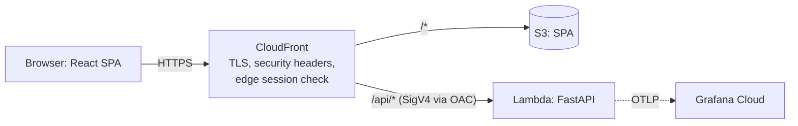

# NetTriage

AI-assisted triage of network threats. Upload AWS VPC Flow Logs, get detections mapped to
MITRE ATT&CK, and a checked, plain-English explanation for every finding.

> Status: Milestone 1 in progress. Plan 1 (walking skeleton) delivers the deployed,
> observable foundation: CI/CD, infrastructure as code and telemetry.

## Architecture



The full design, including what later milestones add, is in the
[spec](docs/superpowers/specs/2026-09-26-nettriage-m1-design.md). Every major choice has an
[architecture decision record](docs/adr/).

## Highlights so far

- About **$0 a month**: serverless on AWS Always Free, with budgets and anomaly alerts ([ADR 0001](docs/adr/0001-serverless-on-aws-always-free.md)).
- **No long-lived keys**: GitHub Actions deploys through OIDC; the Lambda Function URL only accepts CloudFront-signed requests ([ADR 0003](docs/adr/0003-cloudfront-to-function-url-with-oac.md)).
- **Strict security headers** from the edge, including a CSP with no inline scripts (checked in CI).
- **OpenTelemetry** traces and metrics in Grafana Cloud; RFC 9457 errors that carry the trace ID.
- **Supply chain**: SHA-pinned actions, CodeQL, dependency review, Dependabot, Checkov and tflint.

## Develop

Prerequisites: uv, Node LTS with pnpm, Terraform, just (see the plan's prerequisites).

```bash
just            # list tasks
just lint test  # backend checks
just web-check  # frontend lint, tests, build and CSP check
just tf-check   # Terraform format, validate and tests
```

Deployments run from GitHub Actions only: merging to `main` deploys the `dev` stage and runs smoke tests.

## License

Apache-2.0. MITRE ATT&CK® data used in later milestones is © The MITRE Corporation.
