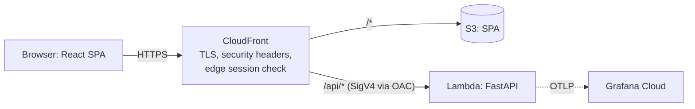

# NetTriage

AI-assisted triage of network threats. Upload AWS VPC Flow Logs, get detections mapped to
MITRE ATT&CK, and a checked, plain-English explanation for every finding.

> Status: Milestone 1 in progress. Plan 1 (walking skeleton) delivers the deployed,
> observable foundation: CI, owner-run deploys, infrastructure as code and telemetry.

## Architecture



The full design, including what later milestones add, is in the
[spec](docs/superpowers/specs/2026-09-26-nettriage-m1-design.md). Every major choice has an
[architecture decision record](docs/adr/).

Regional resources run in eu-north-1 (Stockholm); CloudFront serves the app worldwide.

## Highlights so far

- About **$0 a month**: serverless on AWS Always Free, with budgets and anomaly alerts ([ADR 0001](docs/adr/0001-serverless-on-aws-always-free.md)).
- **No stored cloud credentials**: CI checks and builds with no AWS access; the owner deploys CI-built, CI-green commits with a short-lived sign-in ([ADR 0013](docs/adr/0013-owner-run-deploys-short-lived-credentials.md)). The Lambda Function URL only accepts CloudFront-signed requests ([ADR 0003](docs/adr/0003-cloudfront-to-function-url-with-oac.md)).
- **Strict security headers** from the edge, including a CSP with no inline scripts (checked in CI).
- **OpenTelemetry** traces and metrics in Grafana Cloud; RFC 9457 errors that carry the trace ID.
- **Supply chain**: SHA-pinned actions, CodeQL, dependency review, Dependabot, Checkov and tflint.

## Develop

Prerequisites: uv, Node LTS with pnpm, Terraform, just (see the plan's prerequisites). Deploys
also need AWS CLI 2.32 or later, Terraform 1.11 or later and a signed-in GitHub CLI (`gh`).

```bash
just             # list tasks
just lint test   # backend checks
just web-check   # frontend lint, tests, build and CSP check
just tf-check    # Terraform format, validate and tests
just cloud-check # CI holds no cloud access
```

Backend tests start a local Postgres on their own (no Docker needed); `just db-down` stops it.

Detector quality: `just detection-report` scores every detector's precision and recall on a
seeded, synthetic scenario suite (target: 0.90 or more for both). CI publishes the report on
every run as the `detection-report` artifact and in the job summary.

## Deploy

Only the owner deploys, from their machine, with a short-lived AWS sign-in. The step-by-step
guide is [docs/runbooks/setup-and-deploy.md](docs/runbooks/setup-and-deploy.md).

```bash
aws login --profile nettriage   # short-lived session
just preflight                  # read-only checks of the account
just plan-dev                   # on a PR: plan and post the changes
just deploy-dev                 # on main: deploy CI's artifacts, then smoke tests
```

## License

Apache-2.0. MITRE ATT&CK® data used in later milestones is © The MITRE Corporation.
