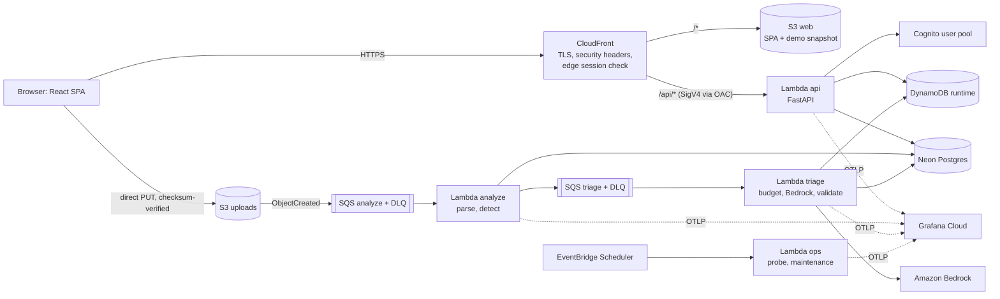
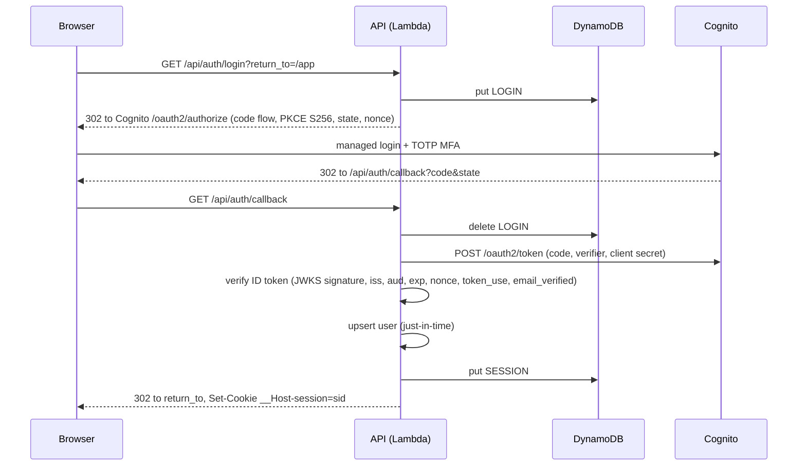
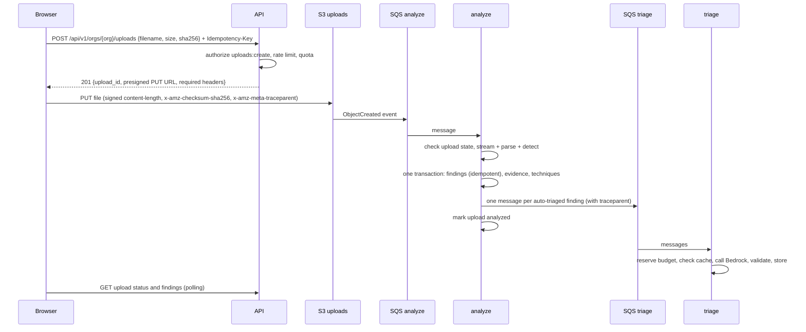

# NetTriage: Milestone 1 Design Spec

| | |
|---|---|
| **Status** | Revision 2 approved 2026-09-27 (revision 1 approved 2026-09-26) |
| **Date** | 2026-09-26, revised 2026-09-27 |
| **Scope** | Product vision (all milestones, high level) and the detailed design of Milestone 1 |
| **License** | Apache-2.0 |
| **Related** | Directors' recap deck (private artifact; its source lives in `presentation/`, which is excluded from Git) |

---

## Revision 2 (2026-09-27): the account's restrictions and the decisions they drive

**Why this revision exists.** The owner's AWS account was created with AWS's newer sign-up experience ("Sign up for AWS (new)"). AWS places these accounts in an organization that AWS manages, and applies policies (service control policies, SCPs) that revision 1 did not anticipate. These facts were verified on the account and in AWS's documentation on 2026-09-27:

- **R1. One Region for regional resources.** Regional resources can only be created in the Region AWS assigned to the account: **eu-north-1 (Stockholm)**. us-east-1 and us-west-2 accept only global services (IAM, CloudFront, Budgets, Cost Explorer, Route 53) and Bedrock model invocation.
- **R2. No IAM identity providers.** `iam:*Provider*` is denied on both the Free and the Paid plan, so GitHub Actions cannot federate into the account with OIDC.
- **R3. No WAF on CloudFront.** AWS WAF can't be associated with a CloudFront distribution.
- **R4. No cross-Region inference.** Bedrock cross-Region and global inference profiles aren't supported; models must be invoked in a Region where they run on demand.
- **R5. Free plan with fixed credits.** The account is on the Free plan with $120 of sign-up credits until **2027-03-08**. It can't be charged while on the Free plan. Upgrading to the Paid plan forfeits these credits. Lifting R1–R3 would take "Activate advanced features" (irreversible, and it requires the Paid plan) or a new account (which would get no free credits).

**Decisions** (each is reflected in the sections below; ADR 0013 records D3–D6):

- **D1. Stay on this account, at $0, within its policies.** Rejected alternatives: activating advanced features (irreversible, forfeits the credits); a new standalone account (no free credits); another cloud provider (DigitalOcean offers $200 for 60 days, has no equivalents for most components, and would cost about $5+ per month afterwards).
- **D2. Regions.** Regional resources live in **eu-north-1**. Global services (CloudFront, IAM, Budgets, Cost Anomaly Detection) stay global. Neon moves to **aws-eu-central-1 (Frankfurt)**, the closest Neon region. Bedrock's Region is chosen per model in Plan 5 (eu-north-1, us-east-1 or us-west-2), using only models available on demand in that Region.
- **D3. CI holds no cloud access.** GitHub Actions runs every check and builds the deployable artifacts once. No workflow requests an OIDC token or references AWS, and a CI check enforces that.
- **D4. The owner deploys, from their machine, with a short-lived sign-in.** Plans and deploys use the owner's `aws login` session. `just deploy-<stage>` deploys only a commit that is on `main`, matches GitHub, and passed CI and CodeQL, and it deploys that commit's CI-built artifacts. `just plan-<stage>` posts an addresses-only plan to the PR. No IAM users or access keys exist.
- **D5. A smaller bootstrap.** The bootstrap creates only the state bucket and the budget and anomaly alerts. The GitHub OIDC provider, the CI roles and the deploy permissions boundary are removed, because no CI identity exists.
- **D6. Secrets in Parameter Store.** The owner stores the Grafana OTLP token once as an SSM SecureString; the deploy reads it from there. GitHub holds no secrets.
- **D7. Unattended jobs move off GitHub Actions.** Drift is checked by every plan and deploy. Nightly evals and backups, which revision 1 gave to GitHub Actions with OIDC, are decided in Plans 5 and 7 (the `ops` Lambda or an owner-run command).
- **D8. No WAF on this account.** The edge session check and the app-level rate limits remain the protection (13.2 already listed this fallback).
- **D9. Timebox.** Milestone 1 finishes before 2027-03-08. After that the owner either upgrades (about $0–1 per month, credits forfeited) or winds the deployment down. Before every deploy, `just preflight` confirms the account still allows what the deploy needs: eu-north-1, the Stockholm Lambda layers, SSM, CloudFront, Budgets and IAM roles.

---

## 0. Summary

NetTriage is a portfolio web application. It ingests network logs (AWS VPC Flow Logs in Milestone 1), runs detection rules for common attacks, and uses an LLM to explain each finding in plain English, mapped to MITRE ATT&CK. It is built as a multi-tenant, serverless system on AWS that costs about $0–1 per month. It is designed to show authentication, authorization, rate limiting, telemetry, database design and architecture practices, together with network security and GenAI skills.

## 1. Context and goals

### 1.1 Purpose

- A public GitHub repository and live demo that strengthen the owner's resume for security engineering, backend engineering and AI/LLM engineering roles.
- Learn network security (protocols, flows, detection engineering) and generative AI (structured outputs, grounding, guardrails, evals) by building a real product.
- Present the design to the owner's directors at a Microsoft-based firm (recap deck with Microsoft equivalents).

### 1.2 Success criteria

- A reviewer can open the public demo without signing up and see realistic findings with AI explanations.
- The repository shows infrastructure as code, CI/CD with security scanning, tests (including security tests), ADRs, a threat model, SLOs and dashboards, and measured quality (detector precision and recall, AI eval scores).
- Steady-state cost is at most $1 per month, with guardrails that make a runaway bill unlikely.

### 1.3 Constraints

- **Budget:** $0 until 2027-03-08. The account is on AWS's Free plan with $120 of sign-up credits and can't be charged; upgrading forfeits the credits. After that date, about $0–1 per month if the owner upgrades (see Revision 2, D9).
- **AWS account:** created with "Sign up for AWS (new)", so it sits in an AWS-managed organization whose policies restrict Regions, IAM identity providers and WAF (Revision 2, R1–R4). Don't activate advanced features: it's irreversible and forfeits the credits.
- **People:** one developer, part-time.
- **Development machine:** Windows 11, 16 GB RAM, 4-core i7-10510U, NVIDIA Quadro P520 with 2 GB. Local GPU inference is not assumed. Python 3.14, .NET 10, Node LTS with pnpm, uv, the AWS CLI (v2.32 or later, for `aws login`), Terraform, `just` and the GitHub CLI are installed; Docker Desktop is needed from Plan 3. Deploys run from this machine (Revision 2, D4).
- **Stack:** Python backend (FastAPI), React + TypeScript frontend, Terraform, GitHub Actions.

### 1.4 Out of scope for Milestone 1

Chat and RAG (M2); text-bearing logs, Azure logs and PCAP (M3); the live lab (M4); WAF-dependent features, automated remediation and passkeys (M5); mobile apps, multi-region and SAML/enterprise SSO.

## 2. Product

### 2.1 Users and roles

- **Anonymous visitor:** browses the public read-only demo, which is a static snapshot.
- **Signed-in user:** belongs to 0–3 organizations, with one role per organization: Owner, Admin, Analyst or Viewer.

### 2.2 Milestone 1 features

1. Sign up and sign in with email, password and mandatory TOTP MFA (Cognito managed login). Sign out, and sign out everywhere.
2. Organizations: create, rename, delete (Owner only), invite by a one-time link bound to an email address, accept an invitation, change roles, remove members, leave.
3. Upload AWS VPC Flow Logs (plain text or gzip, up to 25 MB) directly to S3 and watch processing status.
4. Automatic detection: port scan, SSH/RDP brute force, unusual outbound volume.
5. Findings: a filtered list; a detail view with metrics, an evidence sample, ATT&CK techniques and an activity timeline; triage (status, assignee, comments) with optimistic concurrency.
6. An AI explanation per finding (structured, validated and labeled), re-run on request, with thumbs-up/down feedback.
7. Audit log and AI usage/cost views (Owner and Admin).
8. A public demo: a static snapshot of a demo organization.

### 2.3 Roadmap

Each later milestone gets its own spec, plan and build cycle.

| Milestone | Adds |
|---|---|
| **M1 Walking skeleton + first slice** | This spec |
| **M2 Ask NetTriage** | Chat over findings with RAG (ATT&CK + evidence in pgvector), streamed responses, prompt-injection defenses for chat, the full eval suite, LLM cost dashboards |
| **M3 More sensors** | Zeek (conn, dns, http), SSH auth logs, **Azure virtual network flow logs**, PCAP to flows; beaconing and DNS-tunneling detections; IP reputation enrichment; an injection classifier as an extra signal |
| **M4 Live network lab** | A throwaway lab VPC started with one command; a decoy instance with every port closed whose flow logs feed NetTriage; labeled attack scenarios |
| **M5 Hardening and automation** | WAF (CloudFront flat-rate plan; needs an account whose policies allow WAF with CloudFront, see Revision 2, R3), anomaly baselines, Sigma rules, AI-suggested remediation with human approval, passive checks of an owned domain, passkeys |

## 3. Architecture

### 3.1 Overview



### 3.2 Components

| Component | Service | Notes |
|---|---|---|
| Edge | CloudFront + CloudFront Functions | Default behavior → S3 `web` through OAC; `/api/*` → Lambda Function URL through OAC, caching disabled |
| Web hosting | S3 `web` bucket | Private. Hashed assets are cached for a long time; `index.html` is never cached; `demo/` holds the snapshot |
| API | Lambda `api` (Python 3.14, arm64) | FastAPI behind the Lambda Web Adapter. The Function URL uses `AWS_IAM` auth and only the CloudFront distribution may invoke it. Invoke mode is BUFFERED in M1 (RESPONSE_STREAM arrives with M2 chat) |
| Workers | Lambda `analyze`, Lambda `triage` | Triggered by SQS event source mappings |
| Operations | Lambda `ops` | Scheduled synthetic probe and maintenance jobs (see 9.6 and 9.7) |
| Queues | SQS `analyze`, `triage`, each with a DLQ | `maxReceiveCount` 3; alarms on DLQ depth |
| Relational database | Neon Postgres (region aws-eu-central-1, Frankfurt) | One Neon project per stage; pooled endpoint; pgvector enabled for M2 |
| Hot state | DynamoDB table `runtime` | Provisioned capacity within Always Free; TTL |
| Files | S3 `uploads` bucket | Private, TLS-only, SSE-S3, deleted after 30 days |
| Identity | Cognito user pool, Essentials tier | Managed login; MFA required (TOTP) |
| LLM | Amazon Bedrock (Region chosen per model in Plan 5: eu-north-1, us-east-1 or us-west-2) | Structured outputs; model chosen by evals; on-demand models only, no cross-Region inference profiles (Revision 2, R4) |
| Secrets and config | SSM Parameter Store (SecureString, AWS-managed key) | Database passwords, Cognito client secret, OTLP token, kill switches |
| Telemetry | OpenTelemetry → Grafana Cloud (free tier) | Lambda platform logs stay in CloudWatch for 7 days |
| Scheduling | EventBridge Scheduler | Probe, maintenance |
| IaC and CI/CD | Terraform; GitHub Actions for checks and builds (no cloud access); owner-run deploys with a short-lived `aws login` session | `dev` and `prod` stages in one AWS account (see 11.5) |

### 3.3 Key decisions

Each decision becomes an ADR in `docs/adr/`.

1. **Serverless on AWS Always Free, not EC2 or containers.** Nothing costs money while idle, and there are no NAT gateway, load balancer or public IPv4 charges.
2. **Neon Postgres, not RDS, Aurora or DSQL.** It is the only full Postgres at $0, it includes pgvector, and when it hits a limit it pauses instead of billing.
3. **CloudFront → Lambda Function URL with Origin Access Control, not API Gateway.** This costs $0 and supports streaming for M2. Requests with a body must carry an `x-amz-content-sha256` header, which the frontend's API client computes.
4. **Backend-for-frontend (BFF) sessions, not tokens in the browser.**
5. **DynamoDB for short-lived state** (sessions, sign-in state, rate limits, budgets, idempotency keys).
6. **A GCRA distributed rate limiter** implemented on DynamoDB.
7. **Two queues** (analyze and triage) to isolate slow, costly LLM work.
8. **Bedrock with an eval-selected model** behind a provider-agnostic interface.
9. **No VPC in production.** Hands-on networking happens in the M4 lab.
10. **OpenTelemetry → Grafana Cloud** for traces, metrics and logs.
11. **Terraform with S3 native state locking; one account, two stages.**
12. **An AI-assisted PR review loop:** a Copilot review requested through the GitHub MCP server, each comment verified by Claude, and every merge done by a human.
13. **Owner-run deploys with short-lived credentials; CI holds no cloud access** (Revision 2, D3–D6). Only CI-built artifacts of a CI-green `main` commit are deployed.

### 3.4 Stages, naming and region

- Regional resources live in **eu-north-1 (Stockholm)**, the Region AWS assigned to the account (Revision 2, R1). CloudFront, IAM, Budgets and Cost Anomaly Detection are global. Neon uses aws-eu-central-1 (Frankfurt). Bedrock's Region is chosen per model (3.2).
- The **`dev`** and **`prod`** stages share one AWS account. Resources are named `nettriage-<stage>-<name>`. Each stage has its own Terraform state key, IAM roles, Neon project, Cognito pool, DynamoDB table and buckets.
- Default tags on every resource: `Project=nettriage`, `Env=<stage>`, `ManagedBy=terraform`.
- M1 uses the CloudFront default domain and a Cognito prefix domain. A custom domain is optional and only added if the owner decides to pay for one.

### 3.5 Lambda defaults

| Function | Memory | Timeout | Trigger | Concurrency control |
|---|---|---|---|---|
| `api` | 1024 MB | 29 s | Function URL | Account default |
| `analyze` | 2048 MB | 300 s | SQS `analyze`, batch size 1 | Event source mapping maximum concurrency 2 |
| `triage` | 512 MB | 60 s | SQS `triage`, batch size 5, partial batch responses | Event source mapping maximum concurrency 2 |
| `ops` | 256 MB | 60 s | EventBridge Scheduler | None needed |

- The SQS visibility timeout is 6 × the function timeout.
- Worker concurrency is capped through the event source mapping's maximum concurrency, not reserved concurrency, because new accounts can have a low Lambda concurrency quota (see 13.2).

## 4. Flows

### 4.1 Sign-in (backend-for-frontend)



After the ID token is verified, Cognito's tokens are discarded. The app never calls anything on the user's behalf. `return_to` must be a relative path within the app (open-redirect protection).

### 4.2 Upload → findings → AI explanation



### 4.3 Public demo

`tools/demo_export` reads the demo organization and writes JSON files under `demo/` in the `web` bucket. The SPA's demo mode renders from these files. Anonymous traffic never reaches Lambda, the database or the LLM. A manual CI workflow ("refresh demo") regenerates the snapshot.

## 5. Data design

### 5.1 Stores

| Store | Holds | Why there |
|---|---|---|
| Neon Postgres | Organizations, users, memberships, invitations, uploads, findings, evidence, AI analyses, events, audit log, ATT&CK and detector reference data | Integrity (constraints, foreign keys, row-level security) and flexible queries |
| DynamoDB `runtime` | Sessions, sign-in state, rate-limit keys, AI budget counters, idempotency keys; everything expires through TTL | Atomic single-digit-millisecond updates, Always Free, no row-lock contention |
| S3 | Raw uploads (30 days), the SPA, the demo snapshot, database backups (7 days), Terraform state | Cheap file storage; Neon's 0.5 GB is kept for structured data |

### 5.2 Postgres schema

**Conventions.**
- UUIDv7 primary keys generated in the application.
- `timestamptz` in UTC.
- Allowed values enforced with `text` + `CHECK`.
- `org_id` on every tenant-owned table, with composite foreign keys `(org_id, x_id)` → `(org_id, id)` so rows cannot reference another tenant's rows.
- `created_at` on every table and `updated_at` where rows change.

| Table | Key columns and constraints |
|---|---|
| `users` | `id`, `cognito_sub` UNIQUE, `email`, `display_name`, `last_login_at`, `disabled_at` |
| `organizations` | `id`, `name`, `slug` UNIQUE, `is_demo`, `created_by` → users |
| `memberships` | PK `(org_id, user_id)`; `role` CHECK in (owner, admin, analyst, viewer); `invited_by` |
| `invitations` | `id`, `org_id`, `email`, `role`, `token_hash` UNIQUE, `expires_at`, `created_by`, `accepted_at`, `accepted_by`, `revoked_at`; partial UNIQUE `(org_id, lower(email))` where still pending |
| `uploads` | `id`, `org_id`, `uploaded_by`, `original_filename`, `s3_key`, `size_bytes` CHECK > 0, `sha256`, `format`, `status` CHECK in (pending_upload, processing, analyzed, failed, expired), `failure_reason`, `rows_parsed`, `rows_rejected`, `rejected_samples` jsonb, `findings_truncated`, `flow_time_range` tstzrange, `processed_at`; UNIQUE `(org_id, id)` |
| `detectors` | `id` text PK, `name`, `description`, `version`, `candidate_techniques` text[]. Synced from code at deploy time |
| `attack_techniques` | `id` text PK (for example `T1046`), `stix_id`, `name`, `tactics` text[], `description`, `url`, `attack_version`, `is_subtechnique`, `parent_id`, `deprecated`. Loaded from ATT&CK STIX v19.2, with MITRE's copyright notice kept |
| `findings` | `id`, `org_id`, `upload_id`, `detector_id` → detectors, `detector_version`, `fingerprint`, `severity` CHECK in (low, medium, high, critical), `status` CHECK in (open, investigating, resolved, false_positive), `title`, `src_ip` inet, `dst_ip` inet, `dst_port` int CHECK 0–65535, `protocol` smallint, `time_window` tstzrange, `metrics` jsonb, `assignee_id` → users, `version` int; UNIQUE `(org_id, upload_id, fingerprint)`; UNIQUE `(org_id, id)` (target of child composite FKs); FK `(org_id, upload_id)` → uploads |
| `finding_evidence` | `id`, `org_id`, `finding_id`, `src_ip`, `dst_ip`, `src_port`, `dst_port`, `protocol`, `packets` bigint, `bytes` bigint, `start_ts`, `end_ts`, `action`, `line_no`; FK `(org_id, finding_id)` |
| `finding_techniques` | PK `(finding_id, technique_id, source)`; `org_id`; `technique_id` → attack_techniques; `source` CHECK in (detector, ai); `rationale`; FK `(org_id, finding_id)` → findings |
| `ai_analyses` | `id`, `org_id`, `finding_id`, `status` CHECK in (pending, succeeded, failed, skipped_budget, invalid_output), `provider`, `model_id`, `prompt_version`, `output_schema_version`, `input_hash`, `output` jsonb, `input_tokens`, `output_tokens`, `cost_usd` numeric(10,6), `latency_ms`, `error_code`, `feedback` CHECK in (up, down) or NULL, `feedback_by`; UNIQUE `(finding_id, model_id, prompt_version, input_hash)`; FK `(org_id, finding_id)` → findings |
| `finding_events` | `id`, `org_id`, `finding_id`, `actor_id` (NULL for system events), `type` CHECK in (created, status_changed, assigned, commented, ai_explained), `payload` jsonb. Comments are at most 2,000 characters |
| `audit_log` | `id`, `org_id` (no foreign key, so records outlive the entities they describe), `actor_user_id`, `actor_type` CHECK in (user, system, anonymous), `action`, `target_type`, `target_id`, `outcome` CHECK in (success, denied, error), `ip` inet, `user_agent` (at most 256 characters), `request_id`, `trace_id`, `details` jsonb |

**Initial indexes:**
- `findings (org_id, status, severity, created_at DESC)`, `findings (org_id, upload_id)`, `findings (org_id, src_ip)`
- `uploads (org_id, created_at DESC)`
- `audit_log (org_id, created_at DESC)`
- `ai_analyses (org_id, created_at)` for usage queries
- `finding_events (finding_id, created_at)`

Tenant tables use `ON DELETE CASCADE` from `organizations`, so deleting an org removes its data. The audit log keeps its records.

### 5.3 Tenant isolation, in three layers

1. **Repositories:** every repository call requires an `org_id`.
2. **Composite foreign keys:** they include `org_id`, so the database refuses cross-tenant links.
3. **Row-level security:**
   - `ENABLE` and `FORCE ROW LEVEL SECURITY` are set on every tenant table.
   - The policy is `org_id = current_setting('app.org_id', true)::uuid`, used for both `USING` and `WITH CHECK`.
   - `memberships` additionally allows `user_id = current_setting('app.user_id', true)::uuid`.
   - Every transaction starts with `set_config('app.org_id', …, true)` and `set_config('app.user_id', …, true)`. These settings are scoped to the transaction, which keeps them safe with Neon's transaction-mode pooler.
   - A missing setting yields NULL, which matches no rows.

A dedicated test runs a query with no org filter and must receive zero rows from other organizations.

`users` also has row-level security (the owner's decision, 2026-09-28, Plan 3b). A user sees their own row, and in an organization's transaction the members of that organization. Sign-in finds or creates the user through a `SECURITY DEFINER` function, because the API's role can't read or insert other users' rows.

### 5.4 Database roles and grants

| Role | Used by | Rights |
|---|---|---|
| `nettriage_owner` | Migrations (CI only) | Owns the schema; DDL |
| `app_api` | `api` Lambda | The SELECT/INSERT/UPDATE its endpoints need; INSERT only on `audit_log`; DELETE only on `memberships`, `invitations`, `organizations` |
| `app_analyze` | `analyze` Lambda | SELECT `uploads`, `detectors`; UPDATE of `uploads` status columns only; INSERT `findings`, `finding_evidence`, `finding_techniques`, `finding_events`, `audit_log` |
| `app_triage` | `triage` Lambda | SELECT `findings`, `finding_evidence`, `finding_techniques`, `attack_techniques`; INSERT/UPDATE `ai_analyses`; INSERT `finding_techniques`, `finding_events`, `audit_log` |
| `app_ops` | `ops` Lambda | `SELECT 1` health checks; retention through `SECURITY DEFINER` functions only (purge `audit_log` rows older than 180 days, expire invitations, expire stale pending uploads) |
| `app_backup` | Nightly backup | Read-only with `BYPASSRLS` (needed for a complete dump); used only by the backup workflow |

- Column-level grants limit UPDATEs to the columns each role needs.
- Apart from the read-only backup role, no application role is a superuser, the schema owner, or has `BYPASSRLS`.
- A trigger on `audit_log` rejects UPDATE and DELETE except through the retention function.

### 5.5 DynamoDB `runtime` table

The partition key is `pk` (string), and the TTL attribute is `expires_at`.

| Item | Key | Attributes | Expiry |
|---|---|---|---|
| Session | `SESSION#<sha256(session id)>` | `user_id`, `csrf_token`, `created_at`, `last_seen_at`, `ip`, `user_agent` | Idle 60 min, absolute 12 h (enforced in code; TTL does the cleanup) |
| A user's sessions | `USERSESS#<user_id>` | String set of session hashes, used for "sign out everywhere" | 12 h after the last login |
| Sign-in state | `LOGIN#<state>` | `code_verifier`, `nonce`, `return_to` | 5 min |
| Rate-limit key | `RL#<policy>#<subject>` | `tat` (GCRA theoretical arrival time, ms) | 2 × the policy window |
| Org AI budget | `BUDGET#<org_id>#<yyyy-mm-dd>` | `tokens_reserved`, `tokens_used` | 2 days |
| Global AI budget | `GBUDGET#<yyyy-mm-dd>` | `usd_reserved`, `usd_used` | 2 days |
| Idempotency key | `IDEMP#<user_id>#<key>` | `request_hash`, `status`, `response` | 24 h |

- **Capacity:** provisioned, within the Always Free 25 read and 25 write units per region. `prod` gets 10 RCU / 10 WCU and `dev` gets 3 / 3.
- **Session touches:** `last_seen_at` is rewritten at most once every 5 minutes to save writes.
- **Failure policy:**
  - Sessions **fail closed**: if a session can't be validated, the request gets 401 or 503.
  - Rate limits **fail open**: the request is served, and the failure is logged, counted and alerted on.
  - AI budgets **fail closed**: no Bedrock call is made.

### 5.6 S3 buckets

| Bucket | Layout | Policy |
|---|---|---|
| `nettriage-<stage>-web` | SPA assets; `demo/*.json` | Private; read only by CloudFront through OAC |
| `nettriage-<stage>-uploads` | `orgs/{org_id}/uploads/{upload_id}/raw` | Private, TLS-only, SSE-S3, public access blocked. CORS allows `PUT` from the app origin only. Lifecycle: delete after 30 days, abort incomplete multipart uploads after 1 day. Event notification → SQS `analyze` |
| `nettriage-backups-<suffix>` | `pg/<stage>/<date>.dump` | Private, SSE-S3, deleted after 7 days |
| `nettriage-tfstate-<suffix>` | Terraform state | Versioned, encrypted, TLS-only, native locking |

### 5.7 Retention, quotas and storage budget

| Data | Retention |
|---|---|
| Raw uploads (S3) | 30 days |
| Findings, evidence, AI analyses, events | Until the organization is deleted |
| Audit log | 180 days |
| Telemetry (Grafana Cloud) | 14 days |
| Lambda platform logs (CloudWatch) | 7 days |
| Database backups | 7 days |
| Sessions, sign-in state, rate-limit keys | TTL as in 5.5 |

**Default quotas (configurable):**
- **Uploads:** at most 25 MB per file (enforced by S3 through the signed `content-length`), 250 MB decompressed, 2,000,000 rows, 4 KB per line, 20 uploads per org per day.
- **Organizations:** at most 10 members per org, 3 orgs per user, 20 pending invitations per org.
- **Findings:** at most 50 per upload (highest severity first; the rest are counted in `findings_truncated`) and at most 50 evidence rows per finding.
- **Automatic AI triage:** up to 20 findings per upload, highest severity first. Other findings can be explained on request.

With these limits an upload uses about 0.25 MB, so roughly 2,000 uploads fit in Neon's 0.5 GB.

### 5.8 Migrations

- Alembic, with explicit SQL for security-critical DDL (RLS policies, grants, triggers).
- CI builds a database from nothing, applies every migration, runs the tests, and checks that each migration can be rolled back.
- Production follows expand → migrate → contract. The owner's deploy runs the migrations with the owner role before new code is deployed (§11; CI has no cloud access).

## 6. Identity, access and abuse protection

### 6.1 Cognito configuration

- One user pool per stage, on the **Essentials** feature plan.
- Self-service sign-up with email verification. Cognito's default email sender has a small daily quota, which is accepted for M1.
- The username is the email address. Passwords are at least 12 characters.
- **MFA is required, TOTP only.** There is no SMS option.
- Settings:
  - `PreventUserExistenceErrors` is on.
  - Plus-tier threat protection is off because it costs money (an accepted risk).
- The app client:
  - Is confidential; its secret lives in SSM.
  - Uses the authorization-code grant only, with PKCE (S256).
  - Requests the scopes `openid email profile`.
  - Allows only the exact callback and logout URLs for each stage.

### 6.2 Sessions and cookies

- **The cookie:**
  - Named `__Host-session`; its value is 32 random bytes, base64url-encoded.
  - Attributes `Secure; HttpOnly; SameSite=Lax; Path=/`, with no `Domain`.
  - The server stores only the SHA-256 of the value.
- **Lifetime:** sessions expire after 60 idle minutes or 12 hours in total.
- **Session changes:**
  - Every login creates a new session.
  - Logout deletes the session and redirects to Cognito's logout endpoint.
  - "Sign out everywhere" deletes every session the user has.
- **CSRF:**
  - State-changing requests must send `X-CSRF-Token` equal to the session's token, which is delivered by `GET /api/v1/me`.
  - `Sec-Fetch-Site` must be `same-origin` or `none`.
  - When `Origin` is present, it must equal the app origin.

### 6.3 Onboarding and invitations

- **First login:** creates the user just-in-time from the ID token (`sub`, `email`; `email_verified` must be true).
- **Creating an invitation:** Owners and Admins create one with an email address and a role no higher than their own.
  - The token is 32 random bytes, shown once as `https://<app>/invite#<token>`. The fragment means browsers never send it to servers or write it to access logs.
  - It is stored as a SHA-256 hash, expires after 7 days and can be used once.
- **Accepting:** requires a signed-in user whose verified email matches the invitation's email (compared case-insensitively).

### 6.4 Authorization

| Permission | Owner | Admin | Analyst | Viewer |
|---|:-:|:-:|:-:|:-:|
| `org:read`, `members:read`, `uploads:read`, `findings:read` | ✓ | ✓ | ✓ | ✓ |
| `uploads:create`, `findings:triage`, `findings:comment`, `ai:request`, `ai:feedback` | ✓ | ✓ | ✓ | – |
| `members:invite`, `members:role`, `members:remove` | ✓ any role | ✓ Analyst/Viewer only | – | – |
| `org:update`, `audit:read`, `usage:read` | ✓ | ✓ | – | – |
| `org:delete` | ✓ | – | – | – |

Every member may leave an organization, except its last Owner.

**Rules:**
- **Deny by default.** Every route declares a permission or is explicitly marked public. A test enumerates the routes and fails on any undeclared one (OWASP API5).
- **Object-level checks.** Every object is reached through `/orgs/{org_id}/…`, with a membership check plus RLS. An ID that belongs to another organization returns **404** (OWASP API1).
- **No escalation.** A user can't grant a role above their own or change their own role, and an organization always keeps at least one Owner.
- **No mass assignment.** Every endpoint has explicit request and response schemas (OWASP API3).
- **Denials are recorded.** Each denial writes `authz.denied` to the audit log and increments a metric, and a spike raises an alert.
- **Test matrix.** Every endpoint is tested for each of: owner, admin, analyst, viewer, non-member and anonymous, against a hand-written table of expected outcomes.

### 6.5 Rate limiting (GCRA)

**How GCRA works.** For a policy with `limit` requests per `period`, the emission interval is `T = period / limit` and the burst tolerance is `τ = (burst − 1) × T`. A request at `now` is allowed if `tat − now ≤ τ`, where `tat` is the key's theoretical arrival time and defaults to `now`. On allow, `tat = max(tat, now) + T`.

**Storage.** Conditional updates, never a read followed by a write, so parallel requests can't both take the last slot (amended in Plan 3b: the original read-then-write design would fail open under exactly the contention the concurrency test creates):
1. A new or idle key (no `tat`, or `tat` ≤ now) is set to now + T.
2. Otherwise `tat` grows by T, on condition that `tat − now ≤ τ`.

A failed condition returns the item as it was, which tells whether the request is over the limit. If DynamoDB fails, the request is allowed (fail open) and a metric is incremented.

**Subjects:**
- the user ID for authenticated routes,
- the client IP for unauthenticated routes (taken from `CloudFront-Viewer-Address`, never `X-Forwarded-For`),
- the org ID for org quotas.

**Responses:**
- A blocked request gets `429` with `Retry-After`.
- Limited routes return the IETF `RateLimit-Policy` and `RateLimit` headers, following the latest httpapi draft at implementation time.

| Policy | Subject | Limit | Burst |
|---|---|---|---|
| `api.user` | user | 120 / min | 30 |
| `api.mutation.user` | user | 30 / min | 10 |
| `auth.ip` | IP | 10 / min | 5 |
| `public.ip` | IP | 60 / min | 20 |
| `uploads.org` | org | 20 / day | 5 |
| `invites.org` | org | 20 / day | 5 |
| `ai.rerun.user` | user | 10 / hour | 3 |

### 6.6 AI budgets

- **Default limits:**
  - Each org has a daily budget of 100,000 tokens.
  - A global daily spend cap of $0.50 applies across all orgs.
  - The demo org uses precomputed analyses.
- **Reservations:** before each call the worker atomically reserves the estimate (input estimate + `max_tokens`), conditional on `reserved + estimate ≤ limit`. After the call it settles to the actual usage, and on failure it releases the reservation.
- **Fail closed:** if the budget state can't be read or written, no call is made, and the analysis is stored with status `skipped_budget`.
- **Per-call limits:** `max_tokens` 700, with the input kept at or under about 2,000 tokens by the evidence cap.

### 6.7 Edge and account protections

- **CloudFront Function** (viewer request, on `/api/*`): returns 401 when there is no `__Host-session` cookie, except on `/api/auth/*` and `/api/health`.
- **Response headers policy:**
  - `Strict-Transport-Security: max-age=31536000; includeSubDomains`
  - `Content-Security-Policy: default-src 'self'; script-src 'self'; style-src 'self'; img-src 'self' data:; font-src 'self'; connect-src 'self' https://nettriage-<stage>-uploads.s3.eu-north-1.amazonaws.com; frame-ancestors 'none'; base-uri 'none'; form-action 'self'; object-src 'none'; upgrade-insecure-requests`
  - `X-Content-Type-Options: nosniff`, `Referrer-Policy: strict-origin-when-cross-origin`, `Permissions-Policy` (camera, microphone and geolocation disabled), `Cross-Origin-Opener-Policy: same-origin`, `Cross-Origin-Resource-Policy: same-origin`
  - Fonts are self-hosted, so the CSP needs no third-party origins.
- **Request limits:** JSON request bodies are at most 64 KB. Files never pass through the API.
- **AWS Budgets:**
  - Alerts at $1 and $3, on both actual and forecast spend.
  - At $5, a Budgets **action** attaches a deny policy for `bedrock:InvokeModel*` to the triage role.
  - Cost Anomaly Detection runs with lowered thresholds.
- **Spend cap:** on the Free plan the account can't be charged (Revision 2, R5); the budget alerts above still report usage against the credits.
- **No WAF on this account** (Revision 2, R3 and D8). The CloudFront flat-rate plan's WAF can't be attached here, so the edge session check and the app-level rate limits (6.5) are the protection.

### 6.8 Machine identities and secrets

- **CloudFront → Lambda:** Origin Access Control (SigV4). The Lambda resource policy allows only the distribution to invoke it.
- **Lambda roles** (least privilege, scoped to specific resources):
  - `api`: the `runtime` table, `s3:PutObject` on the uploads prefix (for presigning), and its own SSM parameters.
  - `analyze`: `s3:GetObject` on uploads, receive/delete on the analyze queue, send to the triage queue, and its SSM parameters.
  - `triage`: `bedrock:InvokeModel` on the candidate model ARNs, the budget items in `runtime`, receive/delete on the triage queue, and its SSM parameters.
  - `ops`: its SSM parameters and the health-check reads.
- **Neon:**
  - TLS with `sslmode=verify-full`, and one database role per function.
  - Passwords are SSM SecureStrings, loaded at cold start.
  - Rotation follows a runbook.
  - psycopg's automatic prepared statements are disabled (`prepare_threshold=None`) for compatibility with the transaction pooler.
- **People and automation that change the account** (Revision 2, D3–D6):
  - **The owner** is the only identity that changes infrastructure. The bootstrap, every `terraform plan` and every deploy run from the owner's machine with a short-lived `aws login` session. Commands reach that session through a helper AWS profile (`<profile>-tools`) whose `credential_process` asks the AWS CLI for the current `aws login` session, so a long Terraform run outlives the session's 15-minute credentials, and the tool never writes credentials to disk.
  - **GitHub Actions** has no AWS access: no OIDC trust (the account can't create identity providers, R2), no access keys and no AWS actions in any workflow. A CI check fails if a workflow asks for `id-token: write` or uses an AWS action.
  - **Unattended jobs** that need AWS (nightly evals in Plan 5, backups in Plan 7) run inside AWS as scheduled Lambdas with their own least-privilege roles, or as owner-run commands. Each plan decides which.
- **Deploy secrets:** the Grafana OTLP token is an SSM SecureString (`/nettriage/<stage>/grafana-otlp-auth`) that the owner stores once; the deploy reads it. GitHub holds no secrets.
- **No long-lived AWS keys.** No IAM users or access keys exist.

## 7. API (Milestone 1)

**Conventions.**
- **Paths:** `/api/v1` prefix; auth under `/api/auth`; health at `/api/health`.
- **Payloads:** JSON with UUIDv7 IDs.
- **Errors:** RFC 9457 Problem Details (`type`, `title`, `status`, `detail`, `instance`, `trace_id`), never stack traces.
- **Pagination:** cursor-based (`cursor`, `limit` ≤ 100).
- **Optimistic concurrency:** findings return an `ETag`. `PATCH` requires `If-Match`: a stale version gets **412 Precondition Failed**, and a missing header gets 428.
- **Idempotency:** `Idempotency-Key` is supported on `POST …/uploads` and `POST /orgs` and is kept for 24 hours.
- **SPA request headers:** `x-amz-content-sha256` on every request with a body (the OAC requirement), and `X-CSRF-Token` on state-changing requests.
- **Docs:** interactive API docs are enabled in `dev` only. Each build exports the OpenAPI JSON to the repository.

| Method and path | Permission | Notes |
|---|---|---|
| `GET /api/health` | public (`public.ip`) | Liveness; no database access |
| `GET /api/auth/login` | public (`auth.ip`) | Starts the OIDC flow |
| `GET /api/auth/callback` | public (`auth.ip`) | Completes it and sets the cookie |
| `POST /api/auth/logout` | session | Deletes the session; returns the Cognito logout URL |
| `POST /api/auth/logout-all` | session | Deletes all of the user's sessions |
| `GET /api/v1/me` | session | User, memberships, CSRF token |
| `POST /api/v1/orgs` | session | Create an org (at most 3 per user) |
| `GET /api/v1/orgs/{org}` | `org:read` | |
| `PATCH /api/v1/orgs/{org}` | `org:update` | Rename |
| `DELETE /api/v1/orgs/{org}` | `org:delete` | Requires the org name as confirmation |
| `GET /api/v1/orgs/{org}/members` | `members:read` | |
| `PATCH /api/v1/orgs/{org}/members/{user}` | `members:role` | |
| `DELETE /api/v1/orgs/{org}/members/{user}` | `members:remove` or self | Leave or remove |
| `GET`, `POST /api/v1/orgs/{org}/invitations` | `members:invite` | |
| `DELETE /api/v1/orgs/{org}/invitations/{id}` | `members:invite` | Revoke |
| `POST /api/v1/invitations/accept` | session | Body: token |
| `POST /api/v1/orgs/{org}/uploads` | `uploads:create` | Returns a presigned PUT that expires in 5 minutes |
| `GET /api/v1/orgs/{org}/uploads` | `uploads:read` | |
| `GET /api/v1/orgs/{org}/uploads/{id}` | `uploads:read` | Status and statistics |
| `GET /api/v1/orgs/{org}/findings` | `findings:read` | Filters: status, severity, detector, upload |
| `GET /api/v1/orgs/{org}/findings/{id}` | `findings:read` | With evidence, techniques, latest AI analysis, events; ETag |
| `PATCH /api/v1/orgs/{org}/findings/{id}` | `findings:triage` | Status, assignee; `If-Match` |
| `POST /api/v1/orgs/{org}/findings/{id}/comments` | `findings:comment` | |
| `POST /api/v1/orgs/{org}/findings/{id}/ai-analyses` | `ai:request` | Re-run, subject to budget and rate limits |
| `PUT /api/v1/orgs/{org}/findings/{id}/ai-analyses/{aid}/feedback` | `ai:feedback` | `up` or `down` |
| `GET /api/v1/orgs/{org}/audit-log` | `audit:read` | |
| `GET /api/v1/orgs/{org}/usage` | `usage:read` | AI tokens and cost by day |
| `GET /api/v1/attack-techniques/{id}` | session | Reference data |

## 8. Detection and AI pipeline

### 8.1 Parsing

- **Input:** VPC Flow Logs text, plain or gzip. Gzip is detected from the first bytes (`1f 8b`), never from the file name.
- **Format:**
  - A header line, as in S3-delivered files, defines the field order. Without one, AWS's default v2 format (14 fields) is assumed.
  - Unknown fields are ignored.
  - Required: `srcaddr`, `dstaddr`, `srcport`, `dstport`, `protocol`, `packets`, `bytes`, `start`, `end`, `action`.
  - Used when present: `tcp-flags`, `flow-direction`, `pkt-srcaddr`, `pkt-dstaddr`, `vpc-id`, `interface-id`, `log-status`.
- **Validation:**
  - `-` means null.
  - IPs must parse, ports must be 0–65535, protocol 0–255, counts must not be negative, `start ≤ end`, and `action` must be ACCEPT or REJECT.
  - `NODATA` and `SKIPDATA` records are skipped and counted.
- **Limits while streaming:** 250 MB decompressed, 2,000,000 rows, 4 KB per line. Size is also bounded before upload by the signed `content-length`.
- **Rejection:**
  - If more than 5% of lines are invalid, the upload fails with `not_a_flow_log`.
  - Up to 20 rejected samples are stored (line number, reason, first 120 characters).
- **Output:** the provider-neutral `NetworkFlow` record: `src_ip`, `dst_ip`, `src_port`, `dst_port`, `protocol`, `packets`, `bytes`, `start`, `end`, `action`, optional `direction` and `tcp_flags`, a `source` block (`provider="aws_vpc"`, optional `interface_id` and `vpc_id`), and `line_no`. M3's Azure parser fills the same record.

### 8.2 Detectors (Milestone 1 defaults)

**Common rules:**
- **Internal addresses:** RFC 1918, `100.64.0.0/10`, `fc00::/7` and `fe80::/10`. These become configurable in a later milestone.
- **Windows** are computed on flow start times.
- **Fingerprint:** `sha256(detector_id, version, key entities, window start rounded to 5 min)`.
- **Evidence:** up to 50 flows: the first 10, the last 10, and 30 sampled evenly between them.

| Detector | Rule | Severity | ATT&CK candidates |
|---|---|---|---|
| `port_scan` v1 | In any 5-minute window, one source reaches at least 100 distinct destination ports on one host (vertical) or at least 50 distinct hosts on one port (horizontal), with at least 80% of those flows REJECT or at most 3 packets | Internal source: high. External source: medium, or high at 1,000+ ports/hosts | External: T1595, T1595.001. Internal: T1046 |
| `remote_access_bruteforce` v1 | In any 5-minute window, one source makes at least 30 flows to TCP 22 or 3389 on one host, each at most 20 packets. Spraying variant: one source reaches at least 10 hosts on 22/3389 | Medium. High ("possible successful login") if a later flow from the same source to the same host and port within 30 minutes carries at least 100 KB or lasts at least 5 minutes | T1110, T1110.001, T1110.003; T1021.004 (SSH) or T1021.001 (RDP) when a login may have succeeded |
| `outbound_volume` v1 | An internal source sends at least 50 MB to one external destination within the file, and its robust z-score (median + MAD across per-host maximum outbound volumes) is at least 5. With fewer than 5 internal hosts, or MAD = 0, only the absolute threshold applies | Medium. High at 500 MB or more, or when the destination port is not 80/443 | T1048, T1041, T1567 |

**Quality measurement:**
- `tools/scenarios` generates seeded, labeled datasets: benign background traffic, injected attacks and near-miss negatives.
- CI computes precision and recall per detector and publishes a report. The target on the generated suite is at least 0.9 precision and at least 0.9 recall.
- Because the data is synthetic, these numbers guard against regressions; they don't measure real-world accuracy. The M4 lab adds real traffic.

### 8.3 AI triage

- **Provider interface:** `generate_structured(system, user_json, schema, max_tokens, temperature) → (output, usage, model_id, latency)`. Implementations:
  - `BedrockProvider`: the Converse API with structured output.
  - `OllamaProvider`: the OpenAI-compatible endpoint with a JSON-schema `format`.
  - `FakeProvider`: scripted outputs and failure injection, for tests.
- **Prompt v1** (`backend/prompts/triage/v1.md`) instructs the model to:
  - use only the provided data;
  - pick techniques only from `candidate_techniques`;
  - mention only IPs and ports present in the data;
  - set `insufficient_evidence` when unsure;
  - treat the data block as untrusted and never as instructions.
- **User content:** JSON containing:
  - the detector's ID, version and name, the severity and metrics;
  - typed entities, the time window and the typed evidence rows;
  - the candidate techniques (ID, name, and a description excerpt of at most 500 characters).

  No free text from the uploaded file is included.
- **Output schema v1:**
  - `summary` (≤ 600 chars), `why_it_matters` (≤ 600)
  - `likely_benign_explanations` (≤ 3 items, ≤ 200 chars each), `recommended_next_steps` (1–5 items, ≤ 200 chars each)
  - `attack_techniques` (≤ 3 items of `{id, rationale}`; the ID must match `^T\d{4}(\.\d{3})?$`)
  - `severity_assessment` (`{agrees_with_detector, suggested_severity, reason}`)
  - `confidence` (low / medium / high), `insufficient_evidence` (boolean)
- **Validation:**
  - Schema validation (Pydantic).
  - Techniques must be a subset of the candidates.
  - Every IP address mentioned in the text must appear in the finding's entities or evidence. Ports are checked only when written as `port N` or `<ip>:N`, so counts such as "100 ports" aren't misread as ports.
  - On failure, one repair attempt that includes the validation errors; after that, `invalid_output`.
- **Caching:** `input_hash = sha256(canonical JSON of the user content)`, with a unique key on (finding, model, prompt version, input hash).
- **Call settings:**
  - Temperature 0.1, `max_tokens` 700, timeout 20 seconds.
  - On throttling and 5xx errors, up to 3 retries with exponential backoff and full jitter.
- **Cost:** computed from a per-model price table in config and stored per analysis.
- **Model candidates:** gpt-oss-20b, Ministral 3 8B and Claude Haiku 4.5 (quality baseline), all through Bedrock structured outputs. The exact Bedrock model IDs are taken from the Bedrock console/API at implementation time.
- **Selection:** the eval suite runs on every candidate, and the default is the cheapest model that meets all gates (8.5).

### 8.4 Prompt-injection posture and output handling

- **Structural defense:** in M1, no attacker-controllable free text reaches the model; only validated typed fields do.
- **Limited capability:** the model has no tools and no side effects (Meta's "Rule of Two": untrusted input and private data, but no ability to act).
- **Output handling** (OWASP LLM10):
  - AI text is rendered as plain text, never as HTML or Markdown.
  - Technique links are built only from validated IDs, pointing to `attack.mitre.org`.
  - The UI labels output as "AI-generated" and shows the model and prompt version.
- **M3** adds delimiting ("spotlighting") and an injection classifier as a signal. The capability limits remain the boundary.

### 8.5 Evals

- **Dataset:** about 30 generated findings with expected techniques and expected `insufficient_evidence` flags, including ambiguous and near-miss cases, in `backend/tests/evals/`.
- **Gates:**
  - Schema-valid rate ≥ 99%.
  - Technique accuracy ≥ 90%: the expected techniques are included, and nothing outside the candidates appears.
  - Grounding violations = 0.
  - Insufficient-evidence correctness ≥ 80%.
  - Cost per finding and p95 latency are reported.
- **When evals run:**
  - **Nightly:** the default model only (about $0.01 per run).
  - **On PRs that change prompts or model config:** the default model; same-repo PRs only.
  - **Full model comparison, including Claude:** on manual dispatch only, so eval spend stays inside the budget.
  - Results are posted on the PR and stored as a CI artifact.

### 8.6 Failure handling

| Failure | Behavior |
|---|---|
| Not a flow log, or malformed | The upload is marked `failed` with a readable reason; nothing else is stored |
| A size, row, line or decompression limit is hit | Processing stops early; `failed: limit_exceeded` |
| Worker crash or timeout | SQS retries 3 times, then the message goes to the DLQ and an alarm fires; reprocessing is idempotent |
| Neon asleep or briefly unavailable | Retry with backoff; SQS redelivers |
| Bedrock throttled or down | Backoff and retries, then `failed`, shown as "AI unavailable" with a retry button |
| AI budget exhausted | `skipped_budget`, shown as "AI paused until tomorrow"; detection is unaffected |
| Invalid AI output | One repair attempt, then `invalid_output`; counted in metrics |
| Duplicate event delivery | Ignored through state checks and unique keys |
| An S3 object that doesn't match an upload in `pending_upload` | Ignored and logged (only known uploads are processed) |

## 9. Observability and operations

### 9.1 Instrumentation

- **SDK and resources:** the OpenTelemetry Python SDK. Resource attributes: `service.name` (`nettriage-api`, `-analyze`, `-triage`, `-ops`), `deployment.environment` and `service.version` (the Git SHA).
- **Export path:** each function ships the **OpenTelemetry Lambda collector extension** (layer).
  - The app exports OTLP to localhost.
  - The collector's decouple processor forwards to Grafana Cloud after the response, so export adds no user-facing latency.
  - Fallback: `force_flush` at the end of each invocation (see 13.2).
- **Auto-instrumentation:** FastAPI, psycopg and botocore.
- **Manual spans:** `analyze.parse`, `analyze.detect` and `triage.generate`.
  - `triage.generate` carries GenAI attributes: `gen_ai.operation.name`, `gen_ai.provider.name`, `gen_ai.request.model`, `gen_ai.usage.input_tokens`, `gen_ai.usage.output_tokens` and `gen_ai.response.finish_reasons`.
  - `OTEL_SEMCONV_STABILITY_OPT_IN=gen_ai_latest_experimental` is set, and library versions are pinned.
- **Propagation across async hops:** W3C `traceparent` travels in S3 object metadata (`x-amz-meta-traceparent`, a signed header in the presigned PUT) and in SQS message attributes. Worker spans link to the originating trace.
- **Frontend:** no browser telemetry in M1. Errors show a reference ID (the trace ID).

### 9.2 Metrics

Metric names follow OTel conventions where they exist:
- `http.server.request.duration` (automatic)
- `nettriage.uploads.processed` {outcome} and `nettriage.upload.processing.duration`
- `nettriage.rows.parsed` and `nettriage.rows.rejected`
- `nettriage.findings.created` {detector, severity}
- `nettriage.queue.message.age` {queue}, computed by the workers from `SentTimestamp`
- `gen_ai.client.token.usage` and `gen_ai.client.operation.duration`
- `nettriage.ai.cost.usd`, `nettriage.ai.outcome` {outcome} and `nettriage.ai.cache.hits`
- `nettriage.authz.denied` {permission}, `nettriage.ratelimit.limited` {policy}, `nettriage.csrf.failed` and `nettriage.upload.rejected` {reason}
- `nettriage.signups`
- `nettriage.probe.success` {check}

**Cardinality rule:** no user IDs, org IDs, IPs or free text as metric attributes. Grafana's free tier allows 10k active series.

### 9.3 Logs

- **Format:** JSON with `ts`, `level`, `event`, `message`, `trace_id`, `span_id`, `request_id`, `stage`, `service`, `org_id`, `user_id`, `route`, `status`, `duration_ms`, `error_code`.
- **Never logged:** secrets, tokens, cookies, emails, session IDs, invitation tokens, raw upload lines, prompts or model outputs. A key-based redaction filter enforces this, and tests check it.
- **Platform logs:** Lambda platform logs go to CloudWatch in JSON format with level filtering and are kept for 7 days.

### 9.4 Audit events

`auth.session_created`, `auth.logout`, `auth.logout_all`, `org.created`, `org.renamed`, `org.deleted`, `member.invited`, `member.joined`, `member.role_changed`, `member.removed`, `member.left`, `invitation.revoked`, `upload.created`, `finding.status_changed`, `finding.assigned`, `finding.commented`, `ai.rerun_requested`, `authz.denied`, `budget.exhausted`, and `ratelimit.limited` (sampled: at most one per subject and policy per minute).

### 9.5 Dashboards

All dashboards are managed by Terraform through the Grafana provider:
- service overview,
- pipeline,
- AI (tokens, cost, quality, cache),
- security (denials, rate limits, CSRF failures, sign-ups, upload rejections),
- free-tier usage.

CI adds a deploy annotation for every deploy.

### 9.6 SLOs, alerts and probes

| SLO | Target over 30 days |
|---|---|
| API availability | 99.5% of requests don't return 5xx (429s excluded) |
| API latency | 95% of requests finish in under 1 s, cold starts included |
| Pipeline freshness | 95% of uploads are analyzed within 2 minutes |
| AI coverage | 90% of auto-triaged findings are explained within 5 minutes, when budget allows |

- **Burn-rate alerts:** a fast alert (1 h and 5 min windows, 14.4× burn) and a slow alert (6 h and 30 min windows, 6× burn), following the Google SRE workbook; delivered by email.
- **CloudWatch alarms** (prod only, 5 in total, within the 10 free alarms):
  - analyze DLQ > 0 and triage DLQ > 0,
  - `api` errors, worker errors,
  - Lambda throttles.

  They notify by email through SNS.
- **Budgets** alerts as in 6.7.
- **Runbooks:** every alert links to `docs/runbooks/<alert>.md`.
- **Probe:** the `ops` Lambda runs every 5 minutes and fetches the demo page and `/api/health` through CloudFront. Hourly, it also runs `SELECT 1` against Neon and a DynamoDB read. Frequent database checks would keep Neon awake and use up its free compute hours.

### 9.7 Operations

- **Kill switches:** `ai_enabled` and `uploads_enabled` live in SSM and are re-read every 60 seconds.
- **Maintenance:** the `ops` Lambda runs daily. It expires `pending_upload` rows older than 1 hour and invitations past their date, and purges audit rows older than 180 days.
- **Backups:**
  - A nightly `pg_dump -Fc` to S3, kept for 7 days. Plan 7 decides the runner: the `ops` Lambda, or an owner-run command if packaging `pg_dump` for Lambda proves impractical (Revision 2, D7).
  - Neon's 6-hour point-in-time restore on top of that.
  - Targets: RPO ≤ 24 h (≤ 6 h with point-in-time restore) and RTO ≤ 1 h.
  - One restore drill is performed and documented in M1.
- **Cost watch:**
  - Every resource is tagged.
  - A live AI-spend metric covers the gap while AWS billing data lags.
  - Budgets and Cost Anomaly Detection run with lowered thresholds.
  - A monthly review checklist lives in `docs/cost.md`.
- **Telemetry cost traps avoided:**
  - No CloudWatch metric pulls into Grafana (those are billed per metric requested).
  - Metric cardinality is capped.
  - CloudWatch log retention is short.

## 10. Frontend (Milestone 1)

**Pages:**
- `/` Landing: what NetTriage is, "View the live demo", "Sign in / Sign up", and a GitHub link.
- `/demo`: the read-only demo workspace, rendered from the static snapshot, with a clear "demo" banner.
- `/invite`: reads the token from the URL fragment, signs the user in if needed, then accepts.
- `/app`: an org switcher, plus onboarding (create an org or accept an invitation).
- `/app/orgs/:org/uploads`: the uploads list and an upload dialog with progress. The browser computes the file's SHA-256 before requesting a slot.
- `/app/orgs/:org/findings`: a table with filters (severity, status, detector, upload) and sorting.
- `/app/orgs/:org/findings/:id`:
  - summary and metrics,
  - an evidence table,
  - ATT&CK techniques, linking to attack.mitre.org,
  - an AI explanation panel with the "AI-generated" label, model and prompt version, feedback and re-run,
  - an activity timeline with comments,
  - status and assignee controls.
- `/app/orgs/:org/members`: members, roles, invitations.
- `/app/orgs/:org/audit` and `/app/orgs/:org/usage`: Owner and Admin only.
- `/app/settings`: "sign out everywhere".

**Libraries:**
- React, TypeScript (strict) and Vite.
- React Router and TanStack Query.
- A typed client generated from the OpenAPI spec, with `openapi-typescript` and `openapi-fetch`. A wrapper adds `x-amz-content-sha256` and `X-CSRF-Token`.

**Security:**
- No `dangerouslySetInnerHTML`.
- AI output is rendered as plain text.
- External links use `rel="noopener noreferrer"`.
- The build contains no inline scripts or styles, so the strict CSP works.

**States:** loading and empty states. Problem Details errors appear as messages that include the error reference. A 429 shows the `Retry-After` time.

**Accessibility:** WCAG 2.2 AA is the target (keyboard navigation, labels, contrast).

**Visual design** is guided by the frontend-design skill during implementation.

## 11. Engineering practices

### 11.1 Repository layout

```
nettriage/
├── backend/
│   ├── src/nettriage/
│   │   ├── domain/        flow model, parsers, detectors, ATT&CK mapping (no AWS imports)
│   │   ├── application/   use cases
│   │   ├── ports/         interfaces: repositories, file store, queue, LLM provider, rate limiter, clock
│   │   ├── adapters/      Postgres, DynamoDB, S3, SQS, Bedrock, Ollama, fake LLM, OIDC
│   │   ├── entrypoints/   api/ (FastAPI), analyze.py, triage.py, ops.py
│   │   └── platform/      config, telemetry, logging, errors
│   ├── migrations/
│   ├── prompts/triage/v1.md
│   └── tests/             unit/ integration/ security/ evals/
├── frontend/
├── infra/                 modules/ and envs/dev, envs/prod
├── tools/                 deploy/ (preflight, plan, deploy), scenarios/, demo_export/, attack_loader/, eval_runner/
├── docs/                  architecture.md, adr/, threat-model.md, runbooks/ (incl. setup-and-deploy.md), slo.md, data-handling.md, cost.md, superpowers/
├── .github/               workflows/, CODEOWNERS, dependabot.yml
├── justfile, docker-compose.yml, README.md, SECURITY.md, LICENSE (Apache-2.0)
└── .gitignore             includes presentation/
```

**Architecture style:** hexagonal (ports and adapters), kept pragmatic. An interface exists only where a real second implementation exists: LLM providers, file store and queue for local and test use, the clock for tests.

### 11.2 Tooling

| Area | Backend (Python 3.14) | Frontend |
|---|---|---|
| Packages | uv (lockfile with hashes) | pnpm |
| Lint and format | Ruff, including its security rules | ESLint + Prettier |
| Types | mypy, strict | TypeScript, strict |
| Tests | pytest, Hypothesis, testcontainers, moto | Vitest, Testing Library, Playwright |
| Web and data | FastAPI, Pydantic v2, SQLAlchemy 2.0 Core + psycopg 3, Alembic | React, React Router, TanStack Query |

- **Task runner:** `just`.
- **Pre-commit hooks:** Ruff, the formatters, `terraform fmt` and gitleaks.
- **Backend runtime:** FastAPI runs on Lambda through the Lambda Web Adapter, so the same app runs locally under uvicorn.

### 11.3 Local development

- **`just dev`** starts Docker Compose with:
  - Postgres with pgvector,
  - DynamoDB Local,
  - a moto server for S3 and SQS,
  - `mock-oauth2-server` as the local OIDC provider,
  - `grafana/otel-lgtm` as the local telemetry stack.
- **Processes:** the API runs under uvicorn with reload; the workers run as local processes that poll the local queues; the Vite dev server proxies `/api`, so cookies behave as in production.
- **`just seed`** loads the demo scenario.
- **AI:** the fake provider is the default. Real Bedrock calls use short-lived credentials (see 13.2), and Ollama is optional.

### 11.4 Testing strategy

Implementation is test-first.
- **Unit tests** cover the domain and use cases. Hypothesis property tests on the parser check that it never crashes and never exceeds its limits.
- **Security suites:**
  - the authorization matrix and route-declaration check,
  - RLS cross-tenant isolation,
  - CSRF, session fixation and expiry,
  - a rate-limiter concurrency test (100 parallel requests; exactly the allowed number pass), run against DynamoDB Local in CI, because moto's in-process DynamoDB doesn't make conditional writes atomic,
  - a zip-bomb fixture,
  - redaction of sensitive log fields,
  - a test that fails if any free-text field from an upload could reach the prompt.
- **Integration tests** run against real Postgres (testcontainers) with all migrations applied, DynamoDB Local and moto.
- **Contract checks:** an OpenAPI diff on every PR. The generated frontend client stops compiling when the API drifts.
- **End-to-end:** Playwright smoke tests after each deploy:
  - the demo page loads,
  - health checks pass,
  - a scripted login succeeds (the test user's TOTP code is generated in the test),
  - an upload produces a finding.
- **Reports:** detector precision and recall, AI evals.
- **Coverage:** at least 85% line coverage on `domain/` and `application/`.

### 11.5 CI/CD (GitHub Actions for CI; owner-run deploys)

Revision 2 (D3–D4) splits CI from CD: GitHub Actions verifies and builds, and the owner deploys what it built.

- **Pull request checks (GitHub Actions, no cloud access):**
  - lint and types,
  - unit, integration and security tests,
  - frontend tests and build,
  - the OpenAPI diff,
  - `terraform validate`, `terraform test`, tflint and Checkov,
  - a check that no workflow requests `id-token: write` or uses an AWS action,
  - CodeQL, dependency review and secret scanning with push protection.
- **Plan in review:** the owner runs `just plan-<stage>` on the PR's pushed commit. It uses that commit's CI-built artifacts, reads the deploy secrets from SSM and posts the planned changes (resource addresses only, no attribute values) as a PR comment.
- **Merge to `main`:** CI builds the artifacts once (the Lambda zip and the web build; an SBOM and a build-provenance attestation from Plan 7) and keeps them for 7 days.
- **Deploy (owner-run, `just deploy-<stage>`):**
  1. **Guards:** `just preflight` passes (the account's policies and the Stockholm Lambda layers are still as expected), the checkout is a clean `main` equal to GitHub's `main`, and the `ci` and `codeql` workflow runs for that commit succeeded. Any failure stops the deploy.
  2. Download that commit's CI artifacts, so what's deployed is exactly what CI built and tested.
  3. Run the migrations as the database owner, and give any new database role its login (from Plan 3a). A failed migration stops the deploy before anything in AWS changes; migrations stay backward compatible, so the running code keeps working.
  4. `terraform apply`, with the plan shown and confirmed by the owner. This also detects drift.
  5. Publish the web build (hashed assets immutable, `index.html` no-cache, `demo/` preserved) and invalidate CloudFront.
  6. Run the smoke tests; any FAIL exits non-zero.
- **Promotion to `prod` (Plan 7):** `just deploy-prod` accepts only a commit already deployed to `dev` and smoke-tested there, and deploys the same artifacts; then it adds a Grafana deploy annotation.
- **Scheduled:**
  - a weekly OWASP ZAP baseline scan of `dev` (an HTTP scan; it needs no AWS access),
  - Dependabot for Python, npm, Terraform and GitHub Actions,
  - nightly evals and backups run inside AWS or as owner-run commands (6.8, 9.7).
- **Hardening:**
  - Actions are pinned to commit SHAs.
  - `permissions:` is least-privilege on every job.
  - CI holds no cloud credentials at all. Deploys use the owner's short-lived session and deploy only CI-built artifacts of a CI-green `main` commit.
  - Branch protection on `main` requires PRs and passing checks, with squash merges.
- **Environments:** no GitHub deployment environments; deploying is an owner action.

### 11.6 AI-assisted PR review loop

1. The developer (Claude) opens a PR, and CI runs.
2. For substantial PRs, Claude requests a **GitHub Copilot code review** through the GitHub MCP server (`request_copilot_review`) on "Lite" effort. The Student plan includes Copilot code review and about 200 AI credits a month; each review costs about $0.05–$1 in credits.
3. Claude reads the review (`pull_request_read`) and checks every comment against the code.
   - For a valid comment, it fixes the issue test-first.
   - For a wrong one, it replies with its reasoning (`add_reply_to_pull_request_comment`).
   - It then resolves the thread and pushes.
4. CI runs again, and **the owner reviews and merges**. Copilot reviews don't count as approvals.
5. **Security constraints:**
   - Claude acts only on review comments from Copilot and from the owner. Any other comment is untrusted data (a prompt-injection vector on a public repo) and is flagged to the owner.
   - Access is through OAuth or a fine-grained token limited to this repository, with pull-request read/write and contents read-only permissions.
   - Only the pull-request toolsets are enabled.
   - No auto-merge.
6. **Fallback:** when credits run out or Copilot is unavailable, Claude's own review continues alone.

### 11.7 Infrastructure as code

- **Terraform:**
  - State lives in S3 with native locking (`use_lockfile = true`), versioned and encrypted.
  - A one-time **bootstrap** stack, applied by the owner from their machine, creates the state bucket (eu-north-1) and the budget and anomaly alerts, then moves its own state into that bucket. Everything else changes only through `just deploy-<stage>` (11.5).
- **Modules:** `edge`, `identity`, `app`, `pipeline`, `data` and `observability` (including the Grafana dashboards and alerts). There is no `cicd` module: CI has no cloud identity.
- **Checks:** default tags on every resource; Checkov, tflint and `terraform test` on every PR; drift detection with every plan and deploy.
- **Neon:** managed through its Terraform provider if it proves reliable. Otherwise the projects are created by hand and documented (see 13.2).

### 11.8 Security engineering and supply chain

- **Threat model** (`docs/threat-model.md`):
  - STRIDE per component, with a trust-boundary diagram.
  - Mapped to the OWASP API Security Top 10 (2023) and the OWASP Top 10 for LLM Applications (2026).
  - An explicit list of accepted risks (13.1).
  - Revisited every milestone.
- **Supply chain:**
  - Lockfiles with hashes.
  - Dependency review, pip-audit or osv-scanner.
  - A license check that keeps GPL code out of the deployed bundle.
  - An SBOM and provenance attestation for every release.
- **Repository files:** `SECURITY.md` (how to report a vulnerability) and `CODEOWNERS`.

### 11.9 Documentation

- **README:** what and why, the live demo link, the architecture diagram, a demo GIF, how to run and deploy, cost, security highlights, the roadmap and lessons learned.
- **ADRs:** the 13 decisions in 3.3, one ADR each.
- **C4 diagrams:** context and container level, in Mermaid.
- **Owner runbook:** `docs/runbooks/setup-and-deploy.md`, the step-by-step account setup, bootstrap, plan, deploy, rollback and troubleshooting guide.
- **Other docs:** runbooks, the SLO doc, the data-handling doc (what is stored, for how long, how to delete it) and the cost doc (free-tier usage and guardrails).
- **Attribution:** the MITRE ATT&CK copyright notice is included where the data is used.

## 12. Milestone 1 definition of done

- **Live:**
  - the public demo works,
  - sign-up with MFA works,
  - orgs and invitations work,
  - an upload produces findings in under 2 minutes, followed by AI explanations,
  - triage works,
  - the audit log and usage views work.
- **Measured:** the detector precision/recall report and an eval report for the selected model are published.
- **Secure:**
  - the authorization-matrix, RLS, CSRF, session, rate-limiter and redaction tests pass,
  - the threat model is written,
  - no high-severity CodeQL alerts,
  - the ZAP baseline is clean,
  - SBOM and provenance attestations are produced.
- **Operable:**
  - dashboards, SLOs and burn-rate alerts are live,
  - runbooks exist for every alert,
  - the synthetic probe is running, and drift is checked before every deploy,
  - one restore drill has been performed.
- **Cheap:** $0 on the Free plan until 2027-03-08 (at most $1 per month after an upgrade); budgets, anomaly detection and the Bedrock kill switch are active.
- **Documented:** a README with the diagram and GIF, 13 ADRs, the threat model, the owner's setup-and-deploy runbook and the remaining docs from 11.9.
- **Delivered:** CI with build-once artifacts; owner-run deploys of those artifacts with dev → prod promotion; no stored cloud credentials anywhere; the review loop has been used on real PRs.

## 13. Risks and verification

### 13.1 Accepted risks (documented in the threat model)

- Neon's endpoint is reachable from the internet (TLS plus strong per-role passwords; the free tier has no IP allowlist).
- No CAPTCHA and no Cognito threat protection (cost). Bots are contained by quotas and budgets.
- Dev and prod share one AWS account, the only account available at $0.
- The account depends on policies that AWS manages and can change (Revision 2, R1–R4). `just preflight` detects a change before any deploy.
- Deploys depend on the owner's machine and sign-in; there is no unattended deploy path.
- The Free plan ends on 2027-03-08 (Revision 2, D9).
- Cognito's default email sender has a small daily quota.
- Grafana Cloud's free tier keeps data for 14 days.
- Lambda and Neon cold starts.
- No WAF: this account can't attach WAF to CloudFront (Revision 2, R3).
- Prompt injection can't be fully prevented. It is mitigated structurally (8.4).
- Flow logs can't show whether a login succeeded (a detector limitation, stated in the UI).
- On a public repo, PR comments are untrusted input to the review loop (11.6).

### 13.2 To verify at the start of implementation (with fallbacks)

| Item | Fallback |
|---|---|
| The Lambda Web Adapter and OpenTelemetry collector layers, and the python3.14 runtime, in eu-north-1 (checked by `just preflight`) | `python3.13`; `force_flush` instead of the collector layer |
| Terraform using the owner's `aws login` session through a `credential_process` helper profile (the default in `tools/deploy/`) | Export the session as environment variables for each command, keeping each run under the credentials' 15-minute lifetime |
| Bedrock model IDs, structured-output support and on-demand availability for the candidates in eu-north-1, us-east-1 or us-west-2, without cross-Region inference profiles (Revision 2, R4); whether credits cover Claude | Drop unavailable candidates; run Claude only in manual comparisons |
| Neon Terraform provider reliability | Create the projects by hand and document it (taken in Plan 3a: the provider isn't code-signed and the owner's machine blocks unsigned executables; see ADR 0002) |
| The account's Lambda concurrency quota (new accounts may be low) | Request an increase; workers are already capped at 2 |
| Current Lambda Function URL + OAC permission requirements (resource-policy actions, body-hash header) | Follow AWS's current docs; if needed, API Gateway HTTP API ($1 per million requests) |
| S3 presigned PUT enforcing the signed `content-length`, checksum and metadata headers from browsers | Presigned POST with a policy (`content-length-range`) |
| The OpenTelemetry Lambda collector layer for python3.14/arm64 | `force_flush` at the end of each invocation |
| Python 3.14 arm64 wheels for every dependency | `python3.13` runtime |
| Short-lived AWS credentials for local development | Resolved: `aws login` (Revision 2, D4) |
| Copilot code review availability and credit cost on the owner's Student plan; whether the remote GitHub MCP server requires a paid plan | Claude-only review; the local GitHub MCP server (Docker) or the `gh` CLI |
| Cognito Essentials features and pricing unchanged | Lite tier (TOTP MFA is still available) |

## 14. Owner setup checklist

The step-by-step version is `docs/runbooks/setup-and-deploy.md`.

- [ ] Stay on the Free plan until Milestone 1 is done; don't upgrade and don't activate advanced features (both are irreversible and forfeit the credits). Decide before 2027-03-08 whether to upgrade or wind down.
- [ ] Use no long-lived access keys; sign in to the CLI with `aws login`.
- [ ] Create the budgets and alerts (6.7) with the bootstrap before deploying anything.
- [ ] Bedrock: confirm access to the candidate models in their chosen Regions, and submit Anthropic's use-case form to test Claude.
- [ ] Create a Grafana Cloud free stack and a Neon account (projects in aws-eu-central-1, per 13.2). Store the Grafana OTLP token in SSM.
- [ ] Install Docker Desktop (from Plan 3), Node LTS + pnpm, uv, the AWS CLI (v2.32 or later), Terraform, `just` and `gh`.
- [ ] Create the public GitHub repository (Apache-2.0) and the `protect-main` ruleset. No deployment environments are needed.
- [ ] Check the Copilot plan and AI credits at github.com/settings/copilot.
- [ ] Connect the GitHub MCP server in Claude Code with least-privilege access (11.6).
- [ ] Optional: buy a custom domain (not required for M1).

## Appendix A: AWS ↔ Microsoft equivalents (approximate)

| NetTriage role | AWS or third party | Microsoft / Azure equivalent |
|---|---|---|
| Edge / CDN | CloudFront (+ Functions, OAC) | Azure Front Door (rules engine; Private Link origins) |
| Functions | Lambda | Azure Functions (Flex Consumption) |
| Files | S3 (presigned URLs, lifecycle, events) | Azure Blob Storage (SAS, lifecycle management, Event Grid) |
| Queues | SQS + DLQ | Azure Service Bus queues (built-in dead-letter queue) |
| Key-value | DynamoDB | Azure Cosmos DB for NoSQL |
| Relational | Neon Postgres | No equivalent; closest: Azure Database for PostgreSQL |
| Customer identity | Cognito | Microsoft Entra External ID |
| Service identity | IAM roles | Managed identities + Azure RBAC |
| Region | eu-north-1 (Stockholm) | Sweden Central |
| Deploy identity | Owner's short-lived `aws login` session; CI has no cloud access | `az login` (Microsoft Entra interactive sign-in); a pipeline without federated credentials |
| Account guardrails | AWS-managed organization policies (SCPs) | Azure Policy on a management group |
| Secrets | SSM Parameter Store, KMS | Azure Key Vault, App Configuration |
| LLMs | Amazon Bedrock | Microsoft Foundry |
| Telemetry | CloudWatch, OpenTelemetry, Grafana Cloud | Azure Monitor, Application Insights, Azure Managed Grafana |
| Audit | CloudTrail | Azure Activity log |
| Cost | AWS Budgets, Cost Anomaly Detection | Cost Management budgets, anomaly alerts |
| Network logs (analyzed) | VPC Flow Logs | Virtual network flow logs (M3 parser) |
| IaC | Terraform | Terraform (AzureRM) or Bicep |

## Appendix B: Glossary

- **ATT&CK:** MITRE's public catalog of attacker techniques, with IDs such as T1046.
- **BFF:** backend-for-frontend. The server holds the login state, and the browser holds only an opaque cookie.
- **DLQ:** dead-letter queue, where messages go after repeated failures.
- **GCRA:** the Generic Cell Rate Algorithm, a token-bucket equivalent that stores one timestamp per key.
- **OAC:** CloudFront Origin Access Control, which signs CloudFront's requests to origins.
- **RLS:** Postgres row-level security.
- **SCP:** service control policy, an AWS Organizations policy that caps what any identity in an account can do, even an administrator.
- **SLO:** service level objective.
- **VPC Flow Logs:** AWS's per-connection network metadata records.
